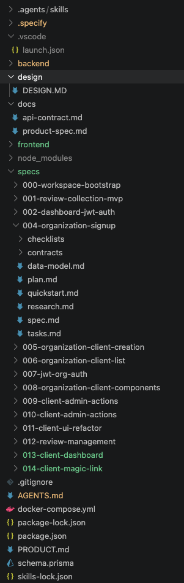
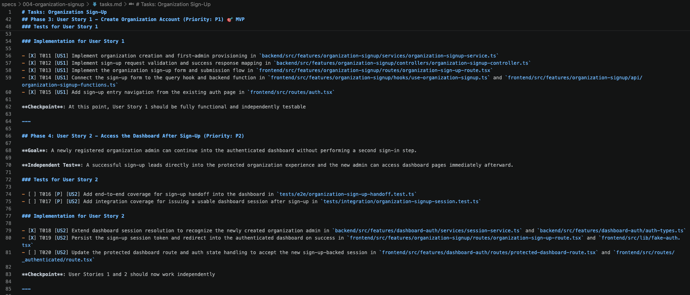

+++
title = "Exemple SDD"
description = "Un projet réel piloté avec GitHub Spec Kit : une spec par fonctionnalité versionnée avec le code, puis son découpage en tâches tracées vers les user stories."
weight = 20
+++

Je vous propose ci-dessous de regarder un projet SDD x IA, mené avec [GitHub Spec Kit](). L'intérêt de cet exemple est de voir **les artefacts réellement produits**, et non le discours qui les entoure.

## Une spécification par fonctionnalité, versionnée avec le code

On écrit d'abord la spécification, ici dans un markdown `spec.md` (`/speckit.specify`).

Deux choses à observer sur cette arborescence, avant même de lire une ligne de spécification.

**La spécification vit dans le dépôt, à côté du code.** Elle est donc versionnée, relue en *pull request* et elle évolue avec le produit. C'est ce qui distingue le SDD d'un cahier des charges : ce n'est pas un document produit en amont puis abandonné, c'est un artefact vivant.

**Il y a une spécification par fonctionnalité, numérotée** (`000-workspace-bootstrap`, `001-review-collection-mvp`, `002-dashboard-jwt-auth`, `004-organization-signup`…). Ce n'est pas *un* gros document mais une **série de petits lots**. Ce détail est décisif pour la question du [retour au Waterfall]() : c'est la taille du lot qui fait la différence, pas l'existence du document.

Chaque dossier de fonctionnalité contient un jeu d'artefacts stable :

| Artefact | Rôle |
| --- | --- |
| `spec.md` | Le **quoi** et le **pourquoi** : besoin, règles, cas limites |
| `plan.md` | Le **comment** technique : architecture, stack, conventions |
| `tasks.md` | Le découpage en tâches exécutables |
| `data-model.md` | Le modèle de données |
| `contracts/` | Les contrats d'interface (API) |
| `checklists/` | Les critères à vérifier avant de considérer le travail fini |

On reconnaît au passage deux pratiques que nous avons déjà croisées : `contracts/` relève du *design-first* d'API (écrire le contrat avant le code, comme dans [l'exemple C4]()), et `checklists/` joue le rôle d'une [Definition of Done]().

## Du plan au découpage en tâches

Puis on demande au LLM de découper cette spécification en user stories et en tâches (`/speckit.tasks`). L'écriture des tâches se base également sur l'architecture et les conventions définies dans `plan.md`.

Ce fichier `tasks.md` est le plus intéressant du lot, parce qu'il ressemble beaucoup à quelque chose que nous connaissons déjà.
mat de chaque tâche** est explicite : `[ID] [P?] [Story] Description`, avec trois conventions notables.

- **`[P]`** : la tâche peut être menée **en parallèle** (fichiers différents, pas de dépendance). C'est une déclaration explicite des [dépendances]() — sauf qu'ici, elle sert à savoir combien d'agents peuvent travailler simultanément.
- **`[Story]`** : à quelle user story la tâche appartient (US1, US2, US3). Chaque tâche est donc **traçable jusqu'à la story** qui la justifie.
- **Les chemins de fichiers exacts** figurent dans la description (`backend/src/features/organization-signup/...`). La spécification doit être assez précise pour un exécutant qui ne posera aucune question.

> [!affirmation] Affirmation
> Ce fichier est un [Sprint Backlog](). Nous écrivions que *dans le Product Backlog on liste les fonctionnalités, alors que dans le Sprint Backlog on liste les activités correspondant aux fonctionnalités à implémenter*. C'est exactement la relation entre `spec.md` et `tasks.md`.

**Les tâches sont organisées en phases**, chacune avec son *Purpose* : `Phase 1: Setup (Shared Infrastructure)`, `Phase 2: Foundational (Blocking Prerequisites)`, puis les phases par user story. Chaque phase se termine par un **Checkpoint** — ici *« Foundation ready – user story implementation can now begin »*.

Enfin, les tâches accomplies sont cochées (`[X]`) directement dans le fichier : le `tasks.md` fait office de [management visuel]() pour l'agent comme pour l'humain, et rend visible l'avancement réel.

## L'implémentation

Et finalement on demande à l'IA d'implémenter le code (`/speckit.implement`), tâche par tâche, en suivant l'ordre des phases.

C'est ici que le [TDD]() prend toute son importance : c'est le seul mécanisme qui permet de vérifier que l'agent a produit ce que la spécification demandait, sans relire chaque ligne.

## Ce que cet exemple révèle

Le SDD ne remplace pas les artefacts agiles, **il les rend obligatoires et écrits**. On retrouve la vision (`spec.md`), le découpage en stories, le backlog de tâches, les critères de fin, la gestion des dépendances — mais formalisés, parce qu'un agent ne peut rien déduire d'une conversation.

Il faut aussi noter ce que l'exemple montre de moins flatteur.

> [!danger] Le découpage généré est horizontal, pas vertical
> La `Phase 2: Foundational` est marquée **« CRITICAL: No user story work can begin until this phase is complete »**. Autrement dit, l'IA a produit une **couche technique partagée bloquante** avant toute story livrable.
>
> C'est un découpage **horizontal** (par couche technique), alors que le découpage agile recherché est **vertical** (une tranche fine mais complète, livrable seule). Cela contredit directement le **I d'[INVEST]()** : ces stories ne sont pas indépendantes, elles héritent d'un prérequis commun.
>
> C'est le réflexe naturel d'un LLM, qui optimise la cohérence technique et non la livraison de valeur incrémentale. **Le rôle humain est ici de contester le plan**, pas de le valider.

Deuxième point de vigilance : la numérotation atteint `012-review-management`. Le projet reste donc discipliné sur la taille de ses lots. Rien n'empêche techniquement de demander à l'IA une spécification unique couvrant six mois de travail — et c'est précisément à ce moment que le SDD devient un [effet tunnel]().
