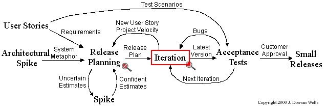
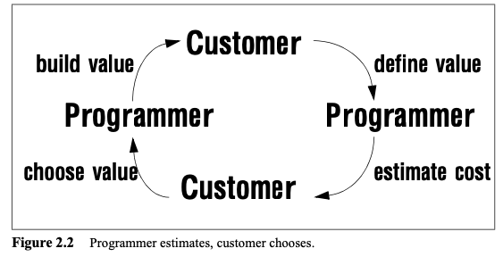
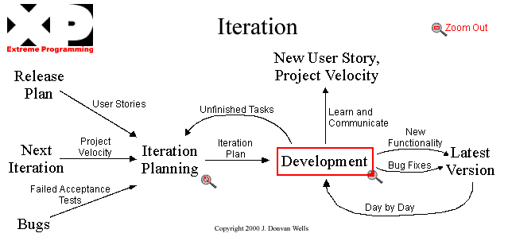
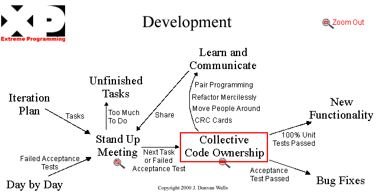
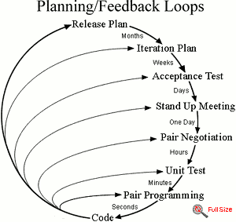

+++
title = "Cycle de vie"
description = "Le cycle de vie d'un projet XP"
weight = 30
+++

> [!ressource] Ressource
> - [Extreme Programming Project](http://www.extremeprogramming.org/map/project.html)

## Vue projet
> [!note] Note
> Une [release est composées de plusieurs itérations]().

XP doit être vue comme système de boucles de feedback, où le client décide principalement de la valeur et des priorités
- Le Release Planning sert à déterminer les User Stories visées pour une release.
- Le client sélectionne et priorise les User Stories en fonction de leur valeur métier.
- Les développeurs estiment les User Stories et apportent les informations nécessaires sur leur coût et leur faisabilité.
> Business value depends on what you get, but also on when you get it and how much it costs. To decide what to do, and when, the custom ers need to know the cost of what they ask for. The programmers, based on experience, provide this information. Then the customers choose what they want, and the programmers build it. Now the picture looks like this. [^1]

- => Le Release Plan résulte de ces deux responsabilités : les choix métier du client confrontés à la capacité estimée puis observée de l'équipe : *« Voilà globalement ce qu'on souhaite obtenir dans cette release. »*

On obtient donc une première boucle de feedback
> Priorités métier → Release Planning → Iterations → vélocité observée → ajustement du Release Plan

## Vue itération

- Chaque itération possède son propre Iteration Planning, réalisé au début de l'itération.
- L'Iteration Planning détermine les User Stories qui seront effectivement traitées pendant l'itération, à partir du Release Plan, des priorités du client et de la vélocité de l'équipe.
- Les User Stories sélectionnées sont décomposées en tâches techniques par les développeurs.
- Ces tâches constituent l'Iteration Plan et guident le travail de développement pendant l'itération.
- => Les résultats de l'itération : un incrément

On obtient une boucle plus courte à l'intérieur de la boucle projet :
> Release Plan → Iteration Planning → Iteration Plan → Development → logiciel fonctionnel → feedback → prochaine Iteration

## Vue développement

- L'Iteration Plan fournit les tâches à réaliser pendant l'itération.
- Chaque journée commence par un Stand Up Meeting, permettant à l'équipe de se coordonner et de déterminer les prochaines tâches à traiter.
- Une tâche n'est pas attribuée de manière permanente à un développeur : XP repose sur le Collective Code Ownership. L'ensemble de l'équipe est responsable du code et peut intervenir sur n'importe quelle partie du système.
- Le développement s'appuie sur plusieurs [pratiques technique]() : Pair Programming, Design System, Refactoring
- Le travail est validé en permanence par les tests : une nouvelle fonctionnalité doit conserver 100 % des tests unitaires au vert, tandis qu'une correction de bug est validée par le test d'acceptation correspondant.
- => Le développement produit ainsi, jour après jour, de nouvelles fonctionnalités et des corrections intégrées à la version courante du logiciel.

On obtient une boucle quotidienne :
> Iteration Plan → Tasks → Stand Up → tâche suivante → développement collectif → tests → intégration → feedback → tâche suivante

## Un cycle de vie basé sur le feedback
Comme vous l'aurez compris, l'une des clés d'Extreme Programming est de multiplier les boucles de feedback tout au long du projet.

Ces boucles existent à différentes échelles :
- À l'échelle d'une release, le feedback est relativement long : il peut s'écouler plusieurs semaines ou mois avant d'observer le résultat auprès du client.
- À l'échelle d'une itération, le feedback est ramené à quelques jours ou quelques semaines. On peut rapidement vérifier que les User Stories réalisées correspondent au besoin.
- À l'échelle d'un test unitaire, le feedback est presque immédiat : quelques secondes ou quelques minutes suffisent pour savoir si une modification fonctionne ou introduit une régression.

> Throughout the project you will be getting intense feedback in many ways, at many levels. Getting working software into the customer's hands will drive the project's iterations with a steady heartbeat and release of valuable software for money spent so far. Changes in requirements will be part of that feedback and gladly accepted.
> Developers receive feedback constantly by working in pairs and testing code as it is written. Managers get feedback on progress and obstacles at the daily stand up meeting. Customers get feedback on progress with acceptance test scores and demonstrations every iteration. [^2]

[^1]: Extreme Programming Installed - chapitre 2
[^2]: http://www.extremeprogramming.org/introduction.html