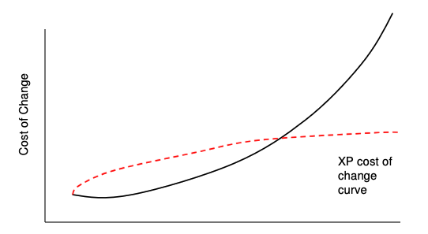

+++
title = "Introduction"
description = "XP est le seul framework agile qui prescrit à la fois une façon de gérer le projet et une façon d'écrire le code."
weight = 1
+++

> [!ressource] Ressources
> - Extreme Programming Explained: Embrace Change - Kent Beck (première édition)
> - Clean Agile - Robert C. Martin - Chapitre 1
> - [Extreme Programming (XP) - La Minute Agile 105](https://blog.myagilepartner.fr/index.php/2018/03/16/extreme-programming/)

> [!definition] Définition
> eXtreme Programming est un framework agile qui organise le développement en itérations courtes et qui prescrit, en plus de cette organisation, un ensemble de **pratiques techniques** destinées à maintenir le logiciel modifiable tout au long de sa vie.

Pour reprendre les termes de Robert C. Martin

> Parmi tous les processus Agile, c'est e**X**treme **P**rogramming qui est le mieux défini, le plus exhaustif et le moins maltraité. Quasi tous les autres processus utilisés dans Agile sont des sous-ensembles ou des variantes de XP.

## Ce qui distingue XP

La plupart des frameworks agiles répondent à la question *comment organisons-nous le travail ?*. XP est le seul à répondre en même temps à la question *comment écrivons-nous le code ?*.

C'est une position singulière, et elle a une raison d'être : XP part du constat que l'agilité n'est pas tenable si le code ne peut pas absorber le changement. Itérer, accueillir une demande nouvelle au sprint suivant, livrer souvent : tout cela suppose un logiciel qui reste souple. Aucune organisation du travail ne produit cette souplesse à elle seule — elle vient de la façon dont le code est écrit, testé et remanié.

Voir [Coût du changement]() et [Naissance de XP]().

## Pour qui XP a-t-il été conçu ?

Kent Beck est explicite sur le périmètre qu'il revendique, et le rappeler évite bien des malentendus :

- des équipes **petites à moyennes** (de l'ordre de la dizaine de développeurs) ;
- des équipes **colocalisées**, ou du moins capables de se parler en continu ;
- des projets dont les **exigences sont floues et changent vite**.

XP n'a jamais prétendu répondre aux projets à très gros effectifs. Cette limite est assumée, et c'est elle qui ouvre la question du [passage à l'échelle]().

## Trois niveaux de lecture

XP ne se présente pas comme une liste de pratiques, mais comme trois niveaux qui s'appuient les uns sur les autres :

| Niveau | Question à laquelle il répond |
| :--- | :--- |
| **Valeurs** | Pourquoi travaillons-nous ainsi ? |
| **Principes** | Quelles lignes directrices en tirons-nous ? |
| **Pratiques** | Que faisons-nous concrètement au quotidien ? |

C'est le sens de lecture à garder : une pratique isolée de sa valeur devient une contrainte arbitraire. Voir [Valeurs et Principes](), puis [Pratiques]() qui organise les pratiques en trois anneaux.

## Une note sur les deux éditions

*Extreme Programming Explained* a connu deux éditions, et elles ne décrivent pas le même jeu de pratiques :

- la **première édition (1999)** décrit **12 pratiques** ;
- la **seconde édition (2004)** les réorganise en **13 pratiques primaires** et **11 pratiques corollaires**.
