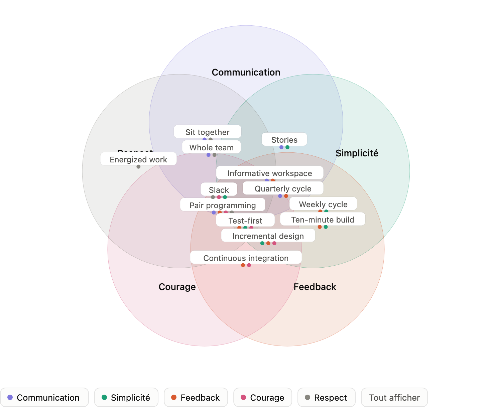

+++
title = "Pratiques"
description = "Les pratiques de XP, organisées par le Circle of Life en trois anneaux : le pilotage, l'équipe, et le travail quotidien du développeur."
weight = 20
+++

> [!ressource] Ressources
> - Clean Agile - Chapitre 1 - section "Le cercle de vie"
> - Extreme Programming Explained: Embrace Change - Kent Beck - chapitre 10 (première édition)
> - [What is Extreme Programming? (Practices)](https://ronjeffries.com/xprog/what-is-extreme-programming/)
> - [The 4 Circles of Extreme Programming](https://jdmeier.com/4-circles-of-extreme-programming/)
> - [https://www.gemserk.com/sum/xp/guidances/concepts/xp_practices_36E149F4.html](https://www.gemserk.com/sum/xp/guidances/concepts/xp_practices_36E149F4.html)

Les [valeurs et principes]() disent pourquoi et selon quelles lignes directrices. Les pratiques disent ce que l'équipe fait, concrètement, tous les jours.

## Anneau extérieur — la relation avec le métier

> The outer green circle is called the "Circle of Life". It's what keeps an XP project going, producing tested working software. The Whole Team, customer members and development members, work together - preferably physically together - to build the project. Using the Planning Game elements of Release Planning and Iteration Planning, they plan a series of Small Releases of software that demonstrably pass all the Customer Tests. [^1]

L'anneau extérieur représente les pratiques de XP orientées vers l'entreprise. Ces pratiques fournissent un cadre pour la manière dont l'équipe de développement logiciel communique avec l'entreprise et les principes de pilotage du projet

- **Le composant majeur de cet anneau est le jeu de la planification active.** Il consiste à décider comment subdiviser un projet en fonctionnalités, en récits et en tâches. Il détermine aussi comment il faudra les estimer, les arranger selon les priorités, puis les planifier.

- **Le principe des petites livraisons fréquentes** pousse l'équipe à travailler par blocs de taille raisonnable.

- **Les tests d'acceptation** déterminent les critères pour considérer quelque chose comme achevé au niveau des fonctions, des histoires et des tâches. Ils montrent à l'équipe comment établir des critères d'achèvement sans équivoque.

- **La notion d'équipe large** rappelle qu'une équipe de développement de logiciel réunit des talents très différents (programmeurs, testeurs, chefs d'équipe), œuvrant tous vers un objectif commun.

## Anneau intermédiaire — le fonctionnement de l'équipe

>  The middle blue circle contains the important supporting practices of XP. The software is designed according to a common, shared, evolving Metaphor that helps it all hang together. It is kept continuously integrated with many system builds every day. The team shares ownership of all the code so that needed changes can be made by any qualified pair. [^1]

L'anneau intermédiaire du cercle correspond aux pratiques de l'équipe dans son ensemble. À ce niveau, il s'agit de définir les conditions dans lesquelles l'équipe communique en interne et assure sa propre gestion :
- **Un rythme soutenable** rappelle que l'équipe de développement doit veiller à progresser à un rythme qui lui évite d'épuiser ses ressources, au risque de ne pas pouvoir franchir la ligne d'arrivée.

- **L'appropriation collective** implique que l'équipe doit rester vigilante pour ne pas laisser le projet se transformer en une batterie de silos cloisonnés.

- **L'intégration continue** permet à l'équipe de rester concentrée, pour ne jamais cesser de collecter les données d'avancement, afin de savoir à tout moment où elle en est.

- **La métaphore** vise à faire prendre conscience de l'importance d'une terminologie rigoureuse adoptée par l'équipe dans ses communications avec ses donneurs d'ordre.

## Anneau interne — le travail du développeur

> The innermost red circle describes the day to day, moment to moment, work of the XP developers. Each feature is addressed with Simple Design. The programmers work in pairs for all production code development, providing continuous code review and valuable. They build the software using Test-Driven Development, and the design is kept clean by the continuous improvement process of Refactoring. [^1]

Enfin, l'anneau interne du Cercle de vie s'intéresse aux pratiques techniques qui doivent guider les programmeurs et les pousser à toujours chercher le plus haut niveau de qualité technique :
- **Le travail en binôme** invite les équipiers à partager leurs connaissances, à vérifier mutuellement leur travail, et à collaborer à un niveau qui encourage l'innovation et l'exactitude.

- **La conception lisible ou claire** est la pratique qui permet à l'équipe de se garder de tout effort inutile.

- **Le réusinage (refactoring)** invite à l'amélioration et au perfectionnement continus de tous les produits.

- **Le développement dirigé par les tests** concerne la barrière de sécurité qui permet à l'équipe technique de progresser rapidement tout en maintenant une qualité optimale.

C'est cet anneau qui n'a pas d'équivalent ailleurs, et qui justifie la remarque suivante :

> The big difference between Scrum and XP is that Scrum does not contain practices specifically for programming, whereas XP has lots of them (TDD, continuous integration, pair programming).

## L'évolution des pratiques XP
> [!ressource] Ressources
> [Thoughts: XP Revisited - évolution de XP](https://ronjeffries.com/articles/018-01ff/xp-revisited-1/)

Initialement, dans Extreme Programming Explained (first edition - 1999) Kent Beck présente 12 pratiques : 
- **The Planning Game** — Déterminer rapidement le périmètre de la prochaine version en combinant les priorités métier et les estimations techniques. Lorsque la réalité remet en cause le plan, celui-ci est mis à jour.
- **Small releases** — Mettre rapidement en production un système simple, puis publier de nouvelles versions à intervalles très courts.
- **Metaphor** — Guider tout le développement à l'aide d'une histoire simple et partagée expliquant le fonctionnement global du système.
- **Simple design** — Concevoir le système de la manière la plus simple possible à chaque instant. Toute complexité supplémentaire est supprimée dès qu'elle est identifiée.
- **Testing** — Les programmeurs écrivent continuellement des tests unitaires, qui doivent tous réussir pour que le développement puisse continuer. Les clients écrivent des tests permettant de vérifier que les fonctionnalités sont terminées.
- **Refactoring** — Restructurer le système sans modifier son comportement afin de supprimer les duplications, d'améliorer la compréhension du code, de le simplifier ou de le rendre plus flexible.
- **Pair programming** — Tout le code destiné à la production est écrit par deux programmeurs travaillant ensemble sur un même poste.
- **Collective ownership** — N'importe quel membre de l'équipe peut modifier n'importe quelle partie du code, à tout moment.
- **Continuous integration** — Intégrer et compiler le système plusieurs fois par jour, chaque fois qu'une tâche est terminée.
- **40 hour week** — Ne pas dépasser 40 heures de travail par semaine en règle générale. Ne jamais faire d'heures supplémentaires deux semaines consécutives.
- **On-site customer** — Intégrer à l'équipe un véritable utilisateur, présent à temps plein et disponible pour répondre aux questions.
- **Coding standards** — Tous les programmeurs écrivent le code conformément à des règles communes qui mettent l'accent sur la communication et la lisibilité du code.

Le Circle of Life est une relecture, due à Ron Jeffries et reprise par Robert Martin, de la liste que Kent Beck publie en 1999. Dans son livre Extreme Programming Installed (2000) Ron Jeffries explique beaucoup plus précisément comment le pratiquer au quotidien.

Par exemple, Chez Beck (1999), le Planning Game est une des 12 pratiques. L'idée fondamentale est de séparer les responsabilités :
- le métier décide de la valeur et des priorités ;
- les développeurs évaluent le coût et la faisabilité technique ;
- les deux collaborent pour déterminer ce qui sera développé.

XP Installed décompose cette pratique en mécanismes beaucoup plus concrets :
- User Stories → estimation des stories → Release Planning → Iteration Planning → réalisation → feedback.

Même phénomène pour les tests, Chez Beck, Testing constitue une pratique XP assez large : les développeurs écrivent des tests automatisés et le client fournit des tests fonctionnels. 
Dans XP Installed, cela devient beaucoup plus opérationnel : 
- Testing → Unit Tests + Test First + Acceptance Tests

Puis en 2004, Beck & Andres révise Extreme Programming Explained (second edition) avec 13 pratiques primaires + 11 pratiques corollaires.
> There are still practices in XP (more than ever). Now, they’re divided into primary practices and corollary practices. Primary practices are ones that are generally safe to introduce one at a time, or in any order. Corollary practices are riskier: they require the support of other practices. [Overview of “Extreme Programming Explained, 2/e”](https://xp123.com/review-extreme-programming-explained-2e/)

| XP 1re édition — 1999 | XP 2e édition — 2004 | Type d'évolution | Changement principal |
|---|---|---|---|
| **Planning Game** | **Weekly Cycle** + **Quarterly Cycle** | Décomposée | La planification devient deux cycles distincts : court terme (semaine) et moyen terme (trimestre/thèmes). |
| **Small Releases** | **Incremental Deployment** + **Daily Deployment** | Poussée plus loin | On passe de petites releases fréquentes à un déploiement incrémental, potentiellement quotidien. |
| **Metaphor** | — | Supprimée | La pratique, difficile à comprendre et appliquer, disparaît de la liste. |
| **Simple Design** | **Incremental Design** (+ Single Code Base) | Reformulée | L'accent passe du « design le plus simple » à un design qui évolue continuellement avec le logiciel. |
| **Testing** | **Test-First Programming** + **Ten-Minute Build** + **Code and Tests** | Précisée / décomposée | Les tests deviennent plus explicitement intégrés au processus de programmation et au build automatisé. |
| **Refactoring** | **Incremental Design** | Absorbée | Le refactoring n'est plus une pratique nommée séparément ; il devient une composante du design incrémental. |
| **Pair Programming** | **Pair Programming** | Conservée | Pratiquement inchangée comme pratique explicite. |
| **Collective Ownership** | **Shared Code** | Renommée | Même principe général : le code appartient à l'équipe et peut être modifié collectivement. |
| **Continuous Integration** | **Continuous Integration** (+ Ten-Minute Build) | Conservée / renforcée | Conservée, mais soutenue par l'exigence d'un build complet et rapide. |
| **40-Hour Week** | **Energized Work** (+ Slack) | Reformulée | On abandonne la durée précise de 40 h au profit de l'objectif : travailler à un rythme soutenable en restant efficace. |
| **On-Site Customer** | **Sit Together** + **Whole Team** + **Real Customer Involvement** | Élargie / décomposée | La présence physique d'un « customer » devient une approche plus générale de proximité, d'équipe complète et d'implication réelle du client. |
| **Coding Standards** | — *(Shared Code + Pair Programming indirectement)* | Absorbée | N'est plus une pratique explicite ; les conventions communes deviennent davantage une conséquence du travail collectif. |

