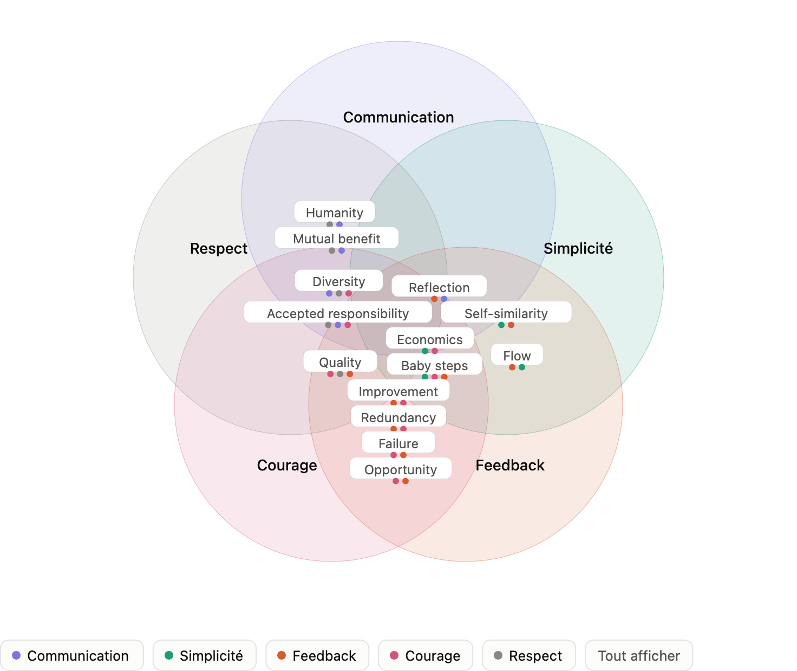

+++
title = "Valeurs et Principes"
description = "Les valeurs disent pourquoi, les principes disent comment décider. Sans eux, les pratiques de XP deviennent des règles arbitraires."
weight = 15
+++

> [!ressource] Ressources
> - Extreme Programming Explained: Embrace Change - Kent Beck - chapitres 7 et 8 (première édition)
> - [Principles of XP - Martin Fowler](https://martinfowler.com/bliki/PrinciplesOfXP.html)

XP s'articule en trois niveaux, que Kent Beck présente comme un pont : les **valeurs** sont trop générales pour guider l'action, les **pratiques** sont trop concrètes pour être transposables telles quelles, et les **principes** relient les deux.

| Niveau | Ce que c'est | Durée de vie |
| :--- | :--- | :--- |
| **Valeurs** | Les croyances fondamentales qui donnent une direction à l'équipe. Elles disent *pourquoi* nous travaillons ainsi. | Stables : elles ne changent pas quand le contexte change. |
| **Principes** | Des lignes directrices concrètes issues des valeurs. Ils permettent de *décider* face à une situation que les pratiques n'avaient pas prévue. | Assez stables, mais un nouveau domaine peut en appeler d'autres. |
| **Pratiques** | Ce que l'équipe *fait* au quotidien. | Situationnelles : elles changent avec le contexte. |

> Practices are situation dependent. If the situation changes, you choose different practices to meet those conditions. **Your values do not have to change in order to adapt to a new situation.** Some new principles may be called when you change domains.

C'est le sens de lecture à retenir, et il explique pourquoi ce cours ne commence pas par les pratiques. Une pratique coupée de sa valeur devient une règle arbitraire — et une règle arbitraire finit toujours par être appliquée à contre-emploi, ou abandonnée.

> Values need to be made explicit because they give meaning to practices. Without them, practices can turn into tedious, dull tasks with no purpose. Whether communication is valuable for someone can be known by the practices also, writing a document 5 pages long instead of 15 minute conversation.

## Les valeurs

La première édition en définit **quatre**. La seconde en ajoute une cinquième, le **respect**.

### Communication

La plupart des problèmes de projet sont des problèmes de communication : quelqu'un savait, ne l'a pas dit, ou l'a dit à la mauvaise personne. XP répond en rendant la communication permanente et directe plutôt qu'écrite et différée — d'où le binôme, le client sur site, la métaphore partagée.

C'est l'exemple donné plus haut : une conversation de quinze minutes vaut mieux qu'un document de cinq pages, non par paresse documentaire, mais parce que le retour y est immédiat.

### Simplicité

Faire **la chose la plus simple qui puisse fonctionner**, aujourd'hui, pour le besoin d'aujourd'hui.

C'est la valeur la plus contre-intuitive, parce qu'elle s'oppose frontalement au réflexe d'anticipation : concevoir large « au cas où ». XP fait le pari inverse — le coût de la complexité ajoutée maintenant pour un besoin hypothétique dépasse le coût de l'ajouter plus tard si le besoin se confirme. Ce pari n'est tenable que si le changement reste bon marché, ce qui renvoie au [coût du changement]().

### Feedback (rétroaction)

Toute décision est une hypothèse, et une hypothèse doit être confrontée à la réalité le plus tôt possible.

XP empile délibérément les boucles de retour, de la plus courte à la plus longue :

| Boucle | Période |
| :--- | :--- |
| Tests unitaires (TDD) | quelques secondes |
| Binôme | continu |
| Intégration continue | quelques minutes à quelques heures |
| Tests d'acceptation, client sur site | quelques jours |
| Itération | une à deux semaines |
| Livraison | quelques semaines |

C'est cette imbrication, plus que chaque pratique prise isolément, qui fait le caractère « extrême » de XP.

### Courage

Le courage d'agir malgré la peur : jeter du code qui ne convient pas, remanier une conception installée, dire qu'une estimation était fausse, annoncer une mauvaise nouvelle tôt.

Le courage seul est dangereux — il devient de l'imprudence. Il ne tient que parce que les autres valeurs le sécurisent : on ose remanier parce que les tests protègent, on ose annoncer parce que la communication est honnête.

### Respect *(ajouté en seconde édition)*

Chaque membre de l'équipe compte, et personne ne dévalorise le travail d'un autre. C'est la valeur la moins spectaculaire, mais Beck l'ajoute après coup en constatant que sans elle, les quatre autres ne survivent pas : on ne communique pas franchement, et on n'ose pas, dans une équipe où l'on est jugé.

Elle rejoint directement la question de la [sécurité psychologique]().

## Les principes

> Les principes sont le pont qui relie les valeurs aux pratiques.

Un exemple : la valeur *communication* ne dit pas s'il faut écrire un document ou parler. Le principe d'humanité, lui, tranche — on choisit la conversation, parce qu'elle répond au besoin de lien, de compréhension mutuelle et de circulation de la connaissance.

### Principes fondamentaux

| Principe | Ce qu'il dit |
| :--- | :--- |
| **Rapid Feedback** | Raccourcir au maximum le délai entre une action et son retour : plus il est court, plus on apprend. |
| **Assume Simplicity** | Traiter chaque problème comme s'il pouvait être résolu simplement, et ne complexifier que sur preuve. |
| **Incremental Change** | Les grands changements ne tiennent pas. On avance par petites modifications successives. |
| **Embracing Change** | Préserver les options ouvertes tout en réglant le problème le plus urgent. |
| **Quality Work** | La qualité n'est pas une variable d'ajustement : personne ne travaille bien en sachant qu'il travaille mal. |

### Principes secondaires

| Principe | Ce qu'il dit |
| :--- | :--- |
| **Teach Learning** | Enseigner à apprendre plutôt que dicter des règles. |
| **Small Initial Investment** | Démarrer avec des moyens contraints, qui forcent les choix. |
| **Play to Win** | Jouer pour gagner, pas pour ne pas perdre. |
| **Concrete Experiments** | Trancher par l'expérience plutôt que par le débat. |
| **Open, Honest Communication** | Communiquer ouvertement et honnêtement, y compris les mauvaises nouvelles, et tôt. |
| **Work with People's Instincts, Not Against Them** | Un processus qui lutte contre les réflexes humains sera contourné. |
| **Accepted Responsibility** | La responsabilité se prend, elle ne s'assigne pas. |
| **Local Adaptation** | Adapter XP à son contexte est prévu, pas simplement toléré. |
| **Travel Light** | Ne conserver que les artefacts réellement utilisés. |
| **Honest Measurement** | Mesurer avec la précision que la mesure permet, pas davantage. |

<embed src="/static/pdf/xp/XP-first-edition-chap8.pdf" width="100%" height="1000px"/>

## L'évolution des principes XP

> [!affirmation] La seconde édition réorganise les principes
> La seconde édition remplace ces deux listes par **quatorze principes** (humanité, économie, bénéfice mutuel, auto-similarité, amélioration, diversité, réflexion, flux, opportunité, redondance, échec, qualité, petits pas, responsabilité acceptée). Ce cours suit la première édition, mais le principe d'**humanité** — cité plus haut — en vient.

Les principes de 2004 (seconde édition) sont beaucoup plus « humains » et économiques que techniques. Humanity et Economics ouvrent la liste : Beck part des besoins des personnes (sécurité, accomplissement, appartenance) et de la valeur pour l'entreprise, là où la première édition partait du coût du changement et de la boucle de feedback.

Mutual Benefit, Self-Similarity, Redundancy et Diversity n'ont pas d'équivalent dans la première édition, et ce sont les plus révélateurs du déplacement :
- Mutual Benefit — refuser les pratiques qui aident quelqu'un aujourd'hui au détriment de quelqu'un d'autre demain. C'est le principe que Beck décrit comme le plus important.
- Self-Similarity — la même structure se retrouve à toutes les échelles : le cycle trimestriel ressemble au cycle hebdomadaire, qui ressemble au cycle test-code-refactor.
- Redundancy — les défauts critiques se traitent par plusieurs mécanismes à la fois (pair programming + tests + intégration continue), même si ça paraît redondant.
- Diversity — le conflit d'opinions dans une équipe est une ressource, pas un problème.