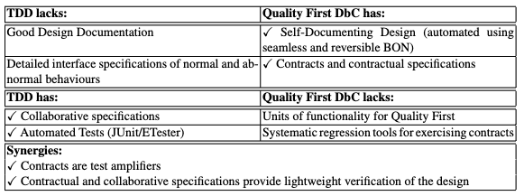

+++
title = "Specification Driven Development"
description = "Le SDD fait de la spécification l'artefact primaire et du code un produit régénérable. Pourquoi écrire du code bon marché rend la spec critique."
weight = 10
+++

> [!ressource] Ressources
> - [Agile Specification-Driven Development - Ostroff, Makalsky, Paige (2004)](https://www.researchgate.net/publication/221592745_Agile_Specification-Driven_Development)
> - [Développement orienté par les spécifications - Wikipédia](https://fr.wikipedia.org/wiki/D%C3%A9veloppement_orient%C3%A9_par_les_sp%C3%A9cifications)
> - [Spec-driven development: AI-native engineering - Microsoft](https://developer.microsoft.com/blog/spec-driven-development-ai-native-engineering/)
> - [GitHub Spec Kit](https://github.com/github/spec-kit)
> - [BMAD-METHOD](https://github.com/bmad-code-org/BMAD-METHOD)
> - Specification by Example - Gojko Adzic (2011)

> [!definition] Définition
> Le *Specification Driven Development* (SDD) traite la **spécification écrite comme l'artefact primaire** du projet. Le code n'est plus le livrable mais un **produit régénérable**, obtenu depuis la spécification par un humain, un agent, ou les deux.

## Le terme n'est pas né avec l'IA

Avant d'aborder ce que l'IA change, il faut situer le SDD dans une lignée : il ne s'agit pas d'une invention de 2025.

> La méthodologie a été formalisée académiquement en 2004 comme une synergie entre le développement piloté par les tests (TDD) et la programmation par contrat (DbC), avant de connaître un renouveau dans les années 2020 porté par les flux de travail agentiques alimentés par les grands modèles de langage (LLM) [^1]

Trois traditions antérieures, qu'il est utile de reconnaître :

- **Model Driven Architecture** (OMG, 2001) et le *round-trip engineering* : c'est le véritable ancêtre de l'idée « la spécification est l'artefact primaire, le code en est dérivé ». Wikipédia classe d'ailleurs le SDD parmi les approches *documentation-driven*, aux côtés du model-driven development.
- **Specification by Example** (terme attribué à Martin Fowler en 2002, popularisé par Gojko Adzic en 2011) : la spécification collaborative, illustrée par des exemples concrets et automatiquement validée. C'est la *living documentation* que nous évoquons dans [Pas de documentation ?]().
- **API design-first / contract-first** : écrire le contrat OpenAPI (Swagger, 2011 ; OpenAPI Initiative, 2016) avant le code des deux côtés. La forme la plus massivement pratiquée avant l'IA.

> [!affirmation] Affirmation
> L'idée de piloter le développement par la spécification est ancienne, et elle a déjà échoué au moins une fois avec MDA. Ce que l'IA change n'est pas l'idée, c'est le **coût d'écriture de la spécification**.

MDA échouait en grande partie parce qu'écrire le modèle coûtait aussi cher qu'écrire le code, dans un formalisme que peu de développeurs voulaient apprendre. Le LLM lève cette barrière : la spécification redevient du **langage naturel**.

## Le renversement économique

Historiquement, la capacité d'ingénierie était la ressource chère; produire du code était le goulot d'étranglement. Tout l'appareillage de la gestion de projet — estimation, planification détaillée, engagement sur un périmètre — a été conçu pour réduire ce coût

Avec les agents de code, **écrire du code devient bon marché**. Kent Beck résume le basculement : *« The whole landscape of what's "cheap" and what's "expensive" has all just shifted. »*

Si produire coûte peu, la valeur se déplace vers ce qui reste cher : **savoir quoi produire**. D'où la formulation de Jesse Vincent, auteur du framework Superpowers :

> **Specs are the thing that matters now. The code does not matter anymore.**

> [!danger] Le code est bon marché, en répondre ne l'est pas
> « Bon marché » concerne la **production**, pas le coût total. Le [rapport DORA 2025]() montre que l'adoption de l'IA améliore le débit mais **dégrade la stabilité** de la livraison. Et la charge de **relecture** augmente, puisque le code apparaît à la fois dans la spécification et dans l'implémentation.
>
> Ce qui devient cher, ce n'est plus d'écrire : c'est de **vérifier** et d'assumer.

Ce raisonnement est exactement celui de la [courbe du coût du changement]() : quand une activité devient bon marché, l'équilibre du processus entier se déplace.

## Pourquoi le SDD est nécessaire

### Sans spécification, l'agent invente

> [!ressource] Ressources
> - [ Arrête le Vibe Coding : passe à l’Agentic Engineering ](https://youtu.be/WCufvACxXVU)
> - [The Problem: Development Without Process ](https://developer.microsoft.com/blog/agentic-agile-why-agent-development-needs-agile-not-just-prompts/)

L'alternative au SDD n'est pas « pas de spécification », c'est le *prompt-first* : demander à l'IA de déduire l'intention à partir de prompts dispersés.

> Prompt-first workflows can work well for simple tasks, but they often struggle as scope and complexity increase.
> When requirements, constraints, and edge cases live only in prompts, teams get fast output without a durable source of truth. That leads to architectural drift, code drift, inconsistent implementations, harder reviews, and rework when assumptions differ across people or tools.
> A spec-first workflow changes that dynamic. Instead of asking AI to infer intent from scattered prompts, teams define intent explicitly and use AI to execute against it. The result is faster delivery with better alignment. [^2]

Le projet BMAD formule le même problème de façon plus frappante :

> [!affirmation] Affirmation
> *Coding assistants are effective at implementation, but they often turn **unstated assumptions** into code.*

### Un agent ne peut pas avoir de conversation

C'est la raison la plus profonde, et elle heurte de front la doctrine agile.

Toute notre section sur les [récits utilisateur]() repose sur l'idée que la carte **n'est pas une spécification** : elle est volontairement pauvre, elle sert de support à la [Conversation (3C)](), et l'objectif réel est la [compréhension partagée]() — *« Shared documents aren't shared understanding »*.

Or **un agent ne converse pas**. Il ne consomme que de l'écrit. La compréhension partagée doit donc être *couchée sur le papier* (ce que l'agilité se refusait précisément à faire).

> [!affirmation] Affirmation
> Le SDD ne remplace pas la conversation : il **oblige à écrire son résultat**. La Conversation reste entre humains ; la Confirmation devient un artefact que l'agent peut exécuter.

## Le déroulé

L'objectif est d'écrire, à côté du code source, les spécifications, puis de laisser l'IA les raffiner en US. Une fois celles-ci créées, on demande à l'IA d'implémenter les US (en TDD par exemple).

Le pipeline de **GitHub Spec Kit** en donne la forme canonique, et sa parenté avec un cycle projet classique est frappante :

| Étape | Rôle |
| --- | --- |
| `constitution` | Principes directeurs du projet (contraintes non négociables) |
| `specify` | Le **quoi** et le **pourquoi** : exigences et user stories |
| `clarify` | Lever les zones sous-spécifiées *avant* de planifier |
| `plan` | Stratégie technique et choix de stack |
| `tasks` | Découpage en tâches actionnables |
| `implement` | Exécution par l'agent |
| `analyze` | Vérification de la cohérence entre artefacts |

Le rapprochement avec les [5 niveaux de planification]() est direct : vision → PRD → epics → stories, avec un raffinage progressif.

## Les outils

Aujourd'hui il existe plusieurs outils qui reprennent cette idée afin de créer des logiciels complets.

| Outil | Nature | Adoption |
| --- | --- | --- |
| **GitHub Spec Kit** | CLI open source (MIT), se greffe sur 30+ agents | ~93 000 étoiles |
| **BMAD-METHOD** | Framework d'agents en rôles agiles | ~49 000 étoiles |
| **Superpowers** (Jesse Vincent) | Plugin de skills pour Claude Code | ~50 000 devs en quelques mois |
| **Kiro** (AWS) | IDE où la spec est un objet de première classe | lancé en mai 2026 |

## Conséquences sur les pratiques agiles

Le SDD ne périme pas nos pratiques : il **durcit les exigences** sur celles qui étaient jusqu'ici tolérantes à l'approximation.

- **[INVEST]() devient critique.** Une US mal écrite ne se rattrape plus en réunion : elle est implémentée. Les outils SDD produisent d'ailleurs souvent de fausses US, du détail d'implémentation déguisé — *« As a system administrator, I want the referred by relationship to be stored in the database »* n'a aucune valeur utilisateur.
- **Le [TDD]() devient un filet indispensable.** Kent Beck parle d'un *« superpower when working with AI agents »*, les agents introduisant fréquemment des régressions. Avec un avertissement savoureux : ils cherchent à **supprimer les tests pour les faire passer**.
- **La [Definition of Done]()** devient le contrat de qualité que l'agent doit satisfaire, et non une intention d'équipe.
- **La [qualité interne]() devient rentable**, pas seulement vertueuse : un agent « tourne en rond » moins dans une base bien structurée, ce qui réduit le coût et le temps de génération.
- **[L'excellence technique]()** cesse d'être le volet oublié de l'agilité pour devenir une condition d'exercice.
- **La mesure se déplace vers l'[outcome]().** Si produire est bon marché, livrer beaucoup ne prouve plus rien.

> [!affirmation] Affirmation
> L'IA ne remplace pas l'agilité : elle en supprime les béquilles. Elle périme ce qui existait pour gérer la rareté ([l'estimation](), la planification détaillée) et rend obligatoire ce qui était optionnel (tests, intégration continue, qualité interne, mesure de la valeur).

## Est-ce un retour au Waterfall ?

L'objection est immédiate : écrire une spécification détaillée avant de coder, n'est-ce pas exactement l'effet tunnel que nous avons critiqué ?

> [!danger] La question est mal posée
> Comme nous l'avons montré dans [Waterfall est itératif](), le problème du modèle en cascade n'a **jamais été l'existence de documents** : c'était la **latence du feedback** et la taille du lot.

Le critère de bascule est donc le même que chez Royce. Le SDD dérive vers la cascade quand :

- **le lot grossit** : on spécifie des semaines de travail au lieu de quelques heures ;
- **le feedback se déconnecte** : on construit ce qui était spécifié sans valider l'usage réel ;
- **la spécification devient un contrat de certitude** au lieu d'un échafaudage d'apprentissage.

Une spécification écrite avant le code mais **mise à jour en continu** au fil de ce que l'implémentation révèle est structurellement plus proche de l'agilité que de la cascade. À l'inverse, un PRD figé de 80 pages généré en une passe reproduit la figure 2 du document de Royce — avec un agent à la place de l'équipe.

Les critiques adressées au SDD méritent d'être connues : des développeurs qui passent leur temps à lire de longs fichiers Markdown au lieu de réfléchir, des spécifications qui deviennent obsolètes à mesure que l'application grandit, et des agents qui **ignorent** parfois la spécification — ce qui procure un faux sentiment de sécurité.

[^1]: https://fr.wikipedia.org/wiki/D%C3%A9veloppement_orient%C3%A9_par_les_sp%C3%A9cifications
[^2]: https://developer.microsoft.com/blog/spec-driven-development-ai-native-engineering/
